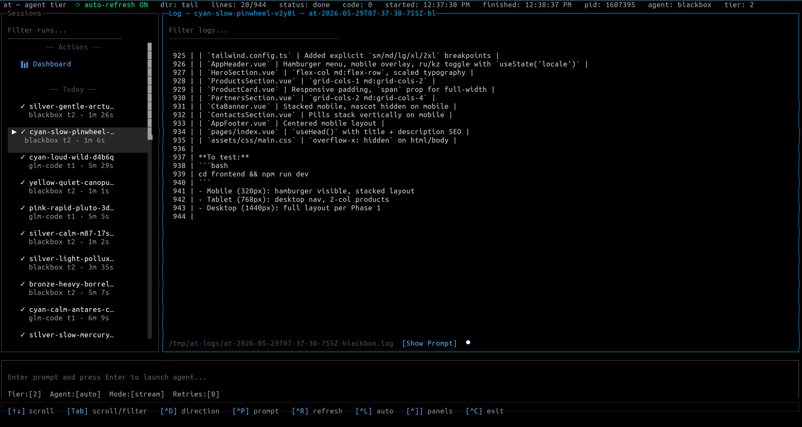

# at — Agent Tier Router

`at` is a thin CLI that routes a coding prompt to one of many AI agent binaries via round-robin scheduling and automatic
retry.



## Install

```bash
npm install
npm run build
# Binary is at dist/cli.js, or install globally:
npm link
```

## Quick start

```bash
# Send a prompt to the default tier (tier 2: dev/QA)
at -p "add error handling to src/api.ts"

# Stream output directly to your terminal
at -s -p "refactor the auth module"

# Target a specific agent
at -a opencode -p "write tests for the parser"

# Use a specific tier
at -t 1 -p "review this PR diff"
```

## CLI reference

```
at [options] [command]

Options:
  -p, --prompt <text>     Prompt text (or pipe via stdin)
  -a, --agent <name>      Agent name, or "auto" (default: auto)
  -t, --tier <number>     Tier: 1=architect, 2=dev (default), 3=experimental
  -s, --stream            Stream output to terminal (default: detached + log file)
  -r, --retries <number>  Max retry attempts on non-zero exit (default: 2)
  --callback <command>    Shell command to run after the agent job finishes
  --global-state          Single round-robin counter shared across all tiers
  --log-dir <path>        Log directory for detached and stream mode (default: /tmp/at-logs)
  --json                  Read JSON from stdin (see JSON mode below)

Commands:
  config sign             HMAC-sign ~/.at/config.json
```

### Sending prompts

Three ways to pass a prompt:

```bash
# Flag
at -p "fix the login bug"

# Stdin pipe
echo "fix the login bug" | at

# JSON mode
echo '{"agent":"opencode","prompt":"fix the login bug"}' | at --json
```

### Output modes

| Mode               | Behavior                                                                                                                                         |
|--------------------|--------------------------------------------------------------------------------------------------------------------------------------------------|
| Detached (default) | Agent spawns in the background; logs go to `/tmp/at-logs/at-<timestamp>-<agent>.log`. Blocks until the agent exits (supports timeout and retry). |
| Stream (`-s`)      | Agent output is streamed to the terminal and simultaneously written to a log file. Blocks until the agent exits.                                 |

## Tiers

| Tier          | Agents                         | Role                       |
|---------------|--------------------------------|----------------------------|
| 1             | glm-code, codex, kimi          | Architect / review         |
| 2 *(default)* | blackbox, opencode, qwen       | Dev / QA                   |
| 3             | kilo, agy, goose, aider, pi | Experimental / boilerplate |

Round-robin state is stored in `/tmp/at-<tier>-state.json`. Pass `--global-state` to use a single counter across all tiers.

## Retry behavior

When an agent exits non-zero, `at` automatically picks the next agent in the same tier and retries, up to
`min(retries, candidates.length - 1)` additional attempts. Named agents (`-a <name>`) never retry.

## JSON mode

Accepts a JSON object from stdin, compatible with the `coding-agent` protocol:

```json
{
  "agent": "opencode",
  "prompt": "add pagination to the users endpoint",
  "model": "gpt-4o",
  "cwd": "/path/to/repo",
  "env": { "SOME_VAR": "value" }
}
```

All fields except `prompt` are optional.

### Available agents

`at` ships with **11 built-in agents** across 3 tiers, plus a generic plugin system for custom agents.

#### Tier 1 — Architect / Review

Agents optimized for complex multi-file refactors, architecture review, and hard problems.

| Agent      | Binary (env override)                    | Command pattern                                       |
|------------|------------------------------------------|-------------------------------------------------------|
| `glm-code` | `GLM_CODE_BIN` → `~/.local/bin/glm-code` | `glm-code -p "prompt" --dangerously-skip-permissions` |
| `codex`    | `CODEX_BIN` → `~/.nvm/.../bin/codex`     | `codex exec "prompt"`                                 |
| `kimi`     | `KIMI_BIN` → `~/.nvm/.../bin/kimi`       | `kimi -y -p "prompt"`                                 |

Round-robin order: glm-code → codex → kimi → glm-code → …

#### Tier 2 — Dev / QA (default)

Everyday feature work, bug fixes, tests, and refactors.

| Agent      | Binary (env override)                      | Command pattern                                        |
|------------|--------------------------------------------|--------------------------------------------------------|
| `blackbox` | `BLACKBOX_BIN` → `~/.local/bin/blackbox`   | `blackbox -p "prompt" --yolo`                          |
| `opencode` | `OPENCODE_BIN` → `~/.nvm/.../bin/opencode` | `opencode run --dangerously-skip-permissions "prompt"` |
| `qwen`     | `QWEN_BIN` → `~/.nvm/.../bin/qwen`         | `qwen -y "prompt"`                                     |

Round-robin order: blackbox → opencode → qwen → blackbox → …

#### Tier 3 — Experimental / Boilerplate

Scaffolding, simple scripts, and throwaway generation. Three of these agents use **Ollama** with local models.

| Agent    | Type   | Binary (env override)                  | Command pattern                                                            |
|----------|--------|----------------------------------------|----------------------------------------------------------------------------|
| `kilo`   | Cloud  | `KILO_BIN` → `~/.nvm/.../bin/kilo`     | `kilo run --auto "prompt"`                                                 |
| `agy`    | Cloud  | `AGY_BIN` → `~/.nvm/.../bin/agy`       | `echo "prompt" \| agy --yolo --skip-trust`                                  |
| `goose`  | Ollama | `GOOSE_BIN` → `~/.local/bin/goose`     | `goose run --text "prompt" --model ... --provider ollama --no-session -q`  |
| `aider`  | Ollama | `AIDER_BIN` → `~/.local/bin/aider`     | `aider --model ollama/... --message "prompt" --yes-always --no-git --exit` |
| `pi`     | Ollama | `PI_BIN` → `~/.nvm/.../bin/pi`         | `pi -p --provider ollama --model ... "prompt" --no-session`                |

Round-robin order: kilo → agy → goose → aider → pi → kilo → …

#### Ollama agents

The three Ollama-based agents (`goose`, `aider`, `pi`) share common configuration:

- **Host:** `OLLAMA_HOST` (default: `http://127.0.0.1:11434`)
- **Model:** `OLLAMA_MODEL` (default: `minimax-m3:cloud`)
- **Per-run model override:** set env var `OLLAMA_AGENT_MODEL` before calling `at`

Note: `aider` additionally uses `OLLAMA_API_BASE` (default same as `OLLAMA_HOST`). `pi` requires an Ollama provider
entry in `~/.pi/agent/models.json`.

#### Prompt mode

Most agents receive their prompt as a CLI argument (`promptMode: 'arg'`). One exception:

- **`agy`**: uses `promptMode: 'stdin'` — the prompt is piped to the agent's stdin rather than passed as an argument.
  `at` handles this internally; no special flags needed.

#### Generic agents (plugins)

You can add custom agents without modifying the source code. Drop a directory under `~/.at/<agent-name>/generic.js`:

```js
// ~/.at/my-agent/generic.js
module.exports = {
  tier: 2,
  bin: () => '/usr/local/bin/my-agent',
  buildArgs: (prompt, model) => ['--task', prompt],
  // optional:
  buildEnv: (model) => ({ MY_MODEL: model ?? 'default' }),
  promptMode: 'arg',  // or 'stdin'
};
```

The directory name becomes the agent name. Override the scan directory with `AT_GENERIC_DIR`. Agents are validated at
load time — `tier` must be 1/2/3, `bin` and `buildArgs` must be functions.

## Binary resolution

Each agent binary is resolved in this order:

1. Environment variable override (e.g. `OPENCODE_BIN`, `GEMINI_BIN`)
2. `$NODE_BIN/<name>` — defaults to the directory of the running `node` binary
3. `$LOCAL_BIN/<name>` — defaults to `~/.local/bin`

Override `NODE_BIN` or `LOCAL_BIN` to point at a different installation path.

## Configuration

`~/.at/config.json` supports per-agent tier overrides:

```json
{
  "tierOverrides": {
    "opencode": 1,
    "goose": 2
  }
}
```

After editing, sign the file to prevent tampering detection:

```bash
at config sign
```

The HMAC secret defaults to `at-config-hmac-v1`; override with `AT_HMAC_SECRET`.

## Development

```bash
npm run dev          # run without building (ts-node)
npm run build        # compile to dist/
npm test             # vitest
npm run test:watch   # vitest --watch
npx vitest tests/runner.test.ts   # single file
```

## Architecture

```
src/cli.ts               parse flags + stdin → resolveFromArgs/parseJsonInput → run()
src/resolver.ts          normalise raw argv/JSON into a typed RunOptions struct
src/scheduler.ts         round-robin state: read/write /tmp/at-<tier>-state.json
src/runner.ts            spawn agent process (stream or detached), retry on non-zero exit
src/agents/registry.ts   AgentDef[] — name, tier, bin(), buildArgs(), buildEnv(), promptMode
src/agents/generic-loader.ts  discover plugins from ~/.at/*/generic.js
src/config.ts            load ~/.at/config.json with HMAC verification
```

**Flow:** `CLI → Resolver → Runner → Scheduler → child process`

### Adding a built-in agent

Add a new `AgentDef` entry to `AGENTS` in `src/agents/registry.ts`. Implement `bin()`, `buildArgs()`, and optionally
`buildEnv()` and `promptMode`. No other files need changing.
